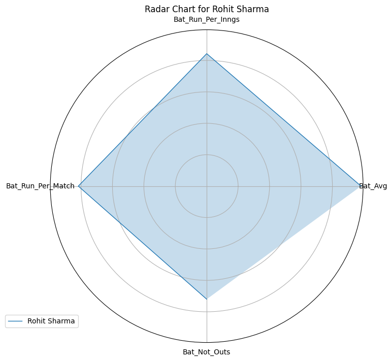

# MatchConRep
 Aims to help ICC Cricket Match Referee in picking the right Like-for-Like Replacement incase a Player on-field suffers a Concussion Injury during any Match.

## Program Flow
 

---

## Radar Chart of Concussed Player
 

## Radar Chart of Like-for-Like Replacement Recommended
 
